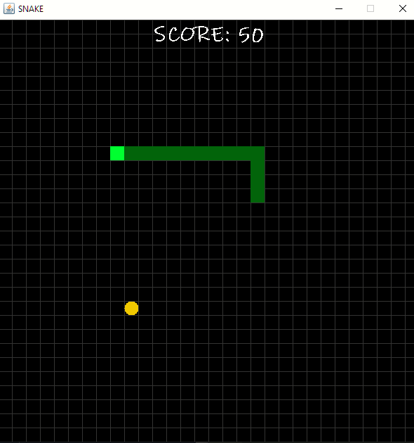

# Snake Game Using Java Swing



## How to compile Java using VScode and Git
1. Select the folder then open `Bash` or `CMD` in that folder
2. Clone this repo by `git clone https://github.com/ullas-i/swing-snakeGame.git`
3. Remember SnakeGame is the package. Open swing-snakeGame

```bash
swing-snakeGame
|
|______SnakeGame
|       |    GameFrame.java
|       |    GamePanel.java
|       |    SnakeMain.java
|
|_______README.md
```

4. Open Visual Studio Code in the swing-snakeGame just by `Code .` in Bash or CMD
## To Compile:

Compile the java program
```bash
javac SnakeGame/*.java
```
Run the game
```bash
java SnakeGame/SnakeMain
```


*Game logic is explained here*
following YouTube tutorial: [Bro Code](https://www.youtube.com/watch?v=bI6e6qjJ8JQ&amp;t=1555s)
